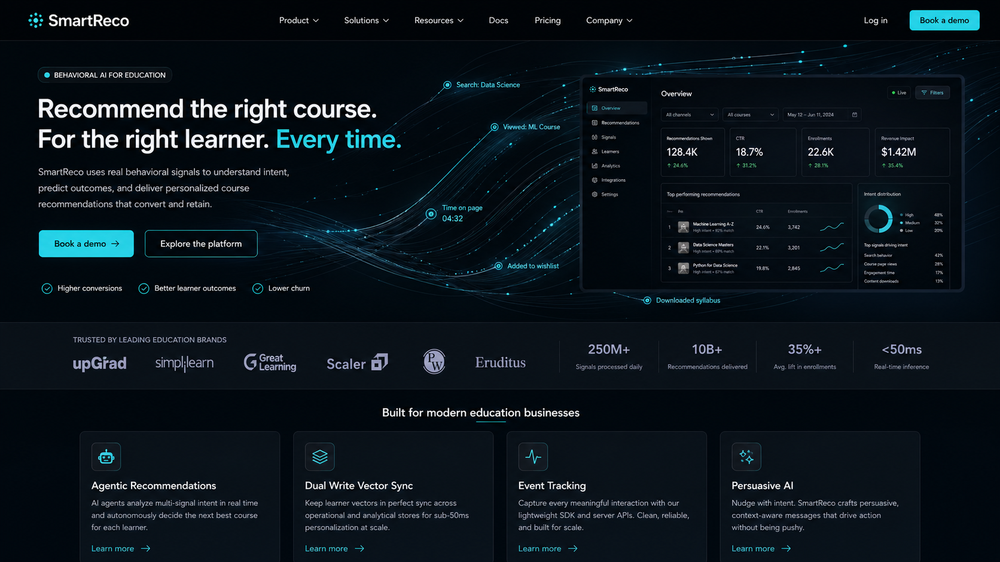
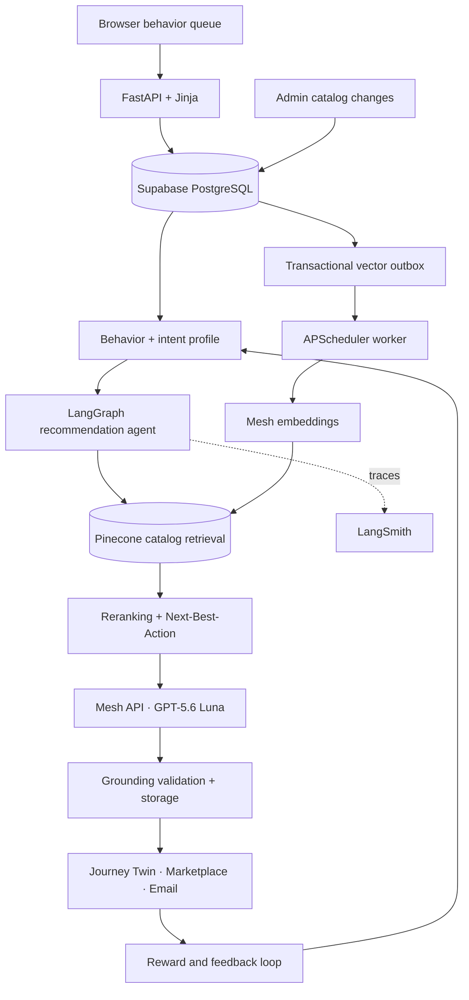

# SmartReco

**The right learning product, at the right moment, with the right persuasion.**

SmartReco is a behavioral AI recommendation platform for learning commerce. It turns searches, course exploration, saves, cart activity, purchases, and feedback into one catalog-grounded next action, explained through a conversational **Journey Twin**.



## Core capabilities

| Capability | What SmartReco does |
|---|---|
| Behavioral intelligence | Builds recency-aware learner profiles from consented searches, views, clicks, dwell time, saves, carts, purchases, dismissals, and feedback. Browser events are deduplicated, batched, and sent without blocking navigation. |
| Grounded recommendations | Retrieves only active catalog items through Pinecone, applies metadata constraints and explainable reranking, then validates product and evidence IDs before anything reaches the learner. |
| Next-Best-Action policy | Selects one useful action: recommend a course, cheaper alternative or prerequisite; offer a bundle; show social proof, career outcomes, or legitimate urgency; schedule email; delay; or stay silent. |
| Adaptive persuasion | Uses career goals, price sensitivity, desired learning speed, intent, and recommendation fatigue to choose how to present the same catalog item. Mesh generates the final grounded copy. |
| Journey Twin | Presents one decisive course or bundle with conversational reasoning, separate market evidence, and working view/add-to-cart actions. |
| Revenue-aware bundles | Compares relevant bundles with standalone options while preserving learner value. Partially owned bundles remain eligible, receive an ownership boost, and charge only for unowned courses at the bundle discount; fully owned products are suppressed. |
| Learner marketplace | Provides a three-section Discover experience; filtered searches show only matching items. It also includes dwell-tracked course pages, heart-based saving, cart and demo checkout, purchase-aware labels, My Courses, privacy/history controls, logout, and collapsible navigation. |
| Identity and commerce safety | Uses email/password authentication, learner/admin roles, PBKDF2 password hashes, signed HTTP-only sessions, CSRF protection, idempotent purchases, and server-authoritative prices. |
| Catalog and administration | Supports course and bundle CRUD, supplied covers, long-form content, prerequisites, outcomes, market evidence, and a compact canonical skill taxonomy used by ranking and interest discovery. |
| Learning and delivery loop | Stores recommendations and decisions, attributes interactions idempotently, updates rewards, and schedules opt-in SMTP recommendations through a dedicated worker. |
| Cost and operations controls | Uses meaningful generation triggers, profile hashes, TTL caches, cooldowns, hourly/daily caps, per-user locks, transactional vector outbox batching, retry/reconciliation, LangSmith tracing, and Prometheus/Grafana monitoring. |

## Architecture



Every language-model and embedding request goes through the Mesh OpenAI-compatible gateway. Recommendation copy is pinned to `openai/gpt-5.6-luna`; catalog embeddings use `openai/text-embedding-3-small` through the same gateway.

## Technology

| Layer | Choice |
|---|---|
| Web | FastAPI, Jinja2, vanilla JavaScript, responsive CSS |
| Data | Supabase PostgreSQL in deployment; SQLite for local development |
| AI and retrieval | Mesh API, GPT-5.6 Luna, Pinecone, catalog grounding |
| Orchestration | LangGraph recommendation workflow, APScheduler workers |
| Observability | LangSmith, structured logs, Prometheus, Grafana |
| Runtime | Docker Compose and GitHub Actions |

## Run locally

Requires Python 3.11+.

```bash
python -m venv .venv

# Windows PowerShell
.venv\Scripts\activate

# macOS/Linux
source .venv/bin/activate

pip install -r requirements-dev.txt
```

Create the local configuration from the template:

```powershell
# Windows PowerShell
Copy-Item .env.example .env
```

```bash
# macOS/Linux
cp .env.example .env
```

For the complete recommendation path, configure Mesh and Pinecone in `.env`. SQLite works locally with the supplied default `DATABASE_URL`.

```bash
python -m scripts.seed
uvicorn src.main:app --reload
```

Open `http://localhost:8000`.

| Local role | Email | Password |
|---|---|---|
| Learner | `learner@smartreco.dev` | `LearnerDemo123!` |
| Admin | `admin@smartreco.dev` | `AdminDemo123!` |

These accounts are local seed data; replace them before a public deployment.

## Configuration

| Group | Environment variables |
|---|---|
| Application | `APP_ENV`, `APP_BASE_URL`, `SECRET_KEY`, `DATABASE_URL`, `SESSION_COOKIE_SECURE` |
| Supabase | `SUPABASE_URL`, `SUPABASE_SERVICE_ROLE_KEY` |
| Mesh | `MESH_API_KEY`, `MESH_CALLS_ENABLED=true`, `MESH_BASE_URL=https://api.meshapi.ai/v1`, `MESH_MODEL=openai/gpt-5.6-luna`, `MESH_EMBEDDING_MODEL=openai/text-embedding-3-small` |
| Pinecone | `PINECONE_API_KEY`, `PINECONE_INDEX_NAME`, `PINECONE_NAMESPACE` |
| Tracing | `LANGSMITH_TRACING`, `LANGSMITH_API_KEY`, `LANGSMITH_PROJECT` |
| Email | `SMTP_HOST`, `SMTP_PORT`, `SMTP_USERNAME`, `SMTP_PASSWORD`, `SMTP_FROM`, `SMTP_USE_TLS` |
| Monitoring | `GRAFANA_ADMIN_USER`, `GRAFANA_ADMIN_PASSWORD`, `GRAFANA_ROOT_URL` |

For SMTP delivery, create SMTP credentials or an app password with your email provider, verify the sender used by `SMTP_FROM`, and add the provider's host, port, username, password, and TLS setting. Scheduled messages are sent only to eligible learners who opted in.

## Deploy with Docker

Apply `migrations/001_initial.sql` through `migrations/005_user_enrollments.sql` to Supabase in order. Set `APP_ENV=production`, a 32+ character `SECRET_KEY`, the Supabase PostgreSQL `DATABASE_URL`, external-service credentials, `SESSION_COOKIE_SECURE=true`, and a strong Grafana password.

```bash
docker compose config --quiet
docker compose build
docker compose --profile bootstrap run --rm catalog-bootstrap
docker compose up -d
```

The bootstrap job synchronizes the SQL catalog with Pinecone through Mesh embeddings. Docker Compose starts the web application, scheduler, Prometheus, and Grafana services.

## Project layout

```text
src/          FastAPI routes, LangGraph agent, services, data models, workers
frontend/     Jinja interfaces, responsive styling, behavioral tracking client
migrations/   Ordered Supabase PostgreSQL schema and entitlement migrations
scripts/      Catalog seed, vector reconciliation, evaluation, bootstrap
monitoring/   Prometheus, Grafana dashboards, and alerts
tests/        Unit and integration tests
```

## Author

Sujato Dutta · AI Engineer and Researcher · [LinkedIn](https://www.linkedin.com/in/sujato-dutta/)
